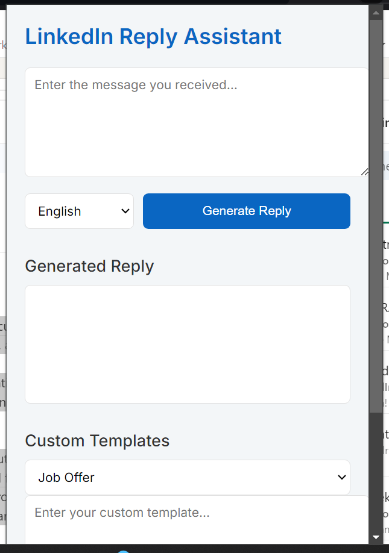
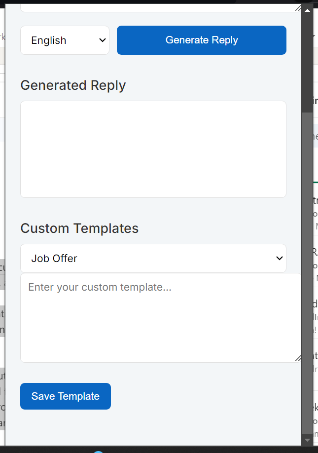
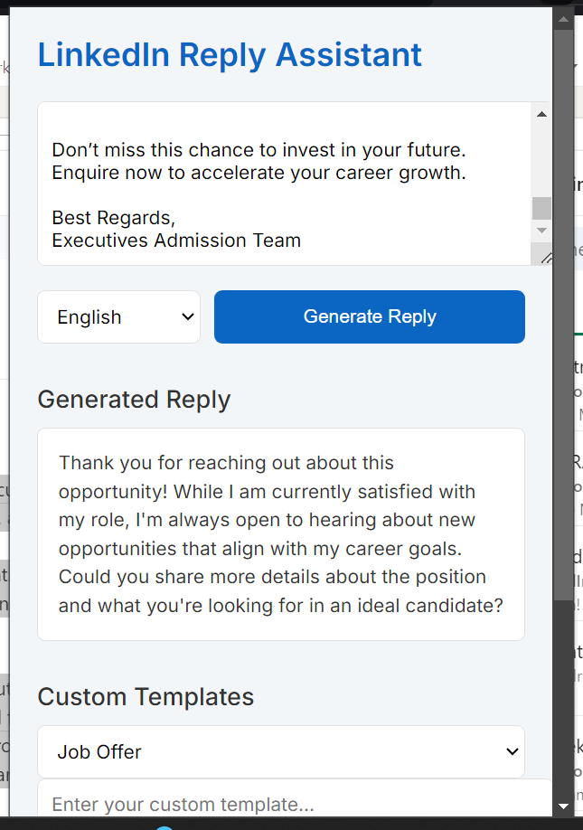
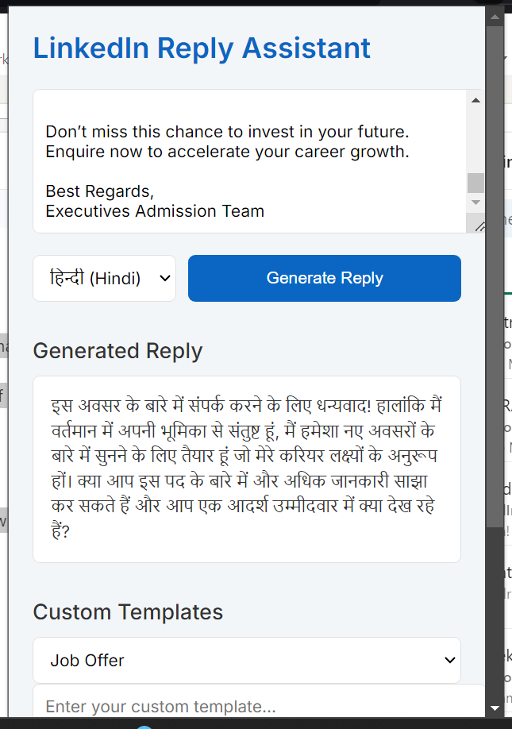
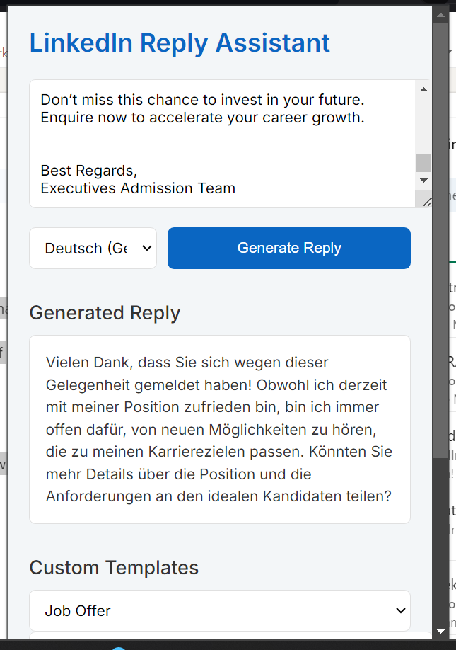
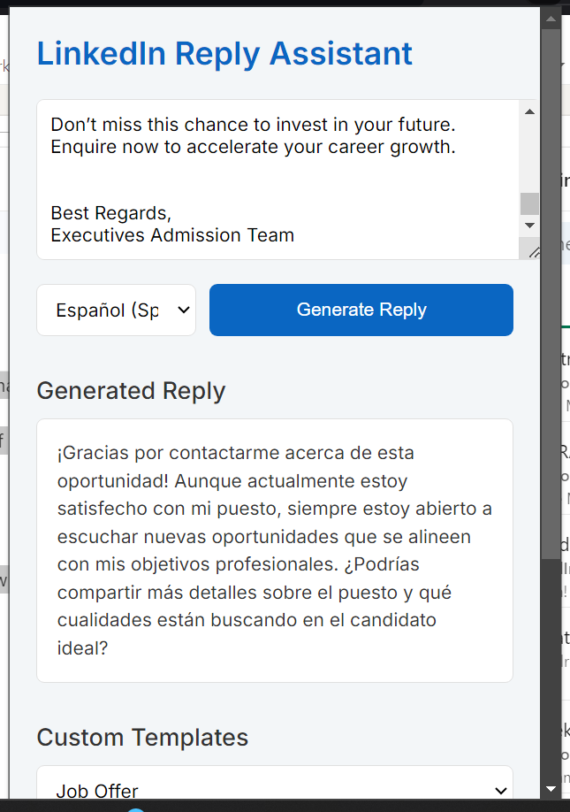
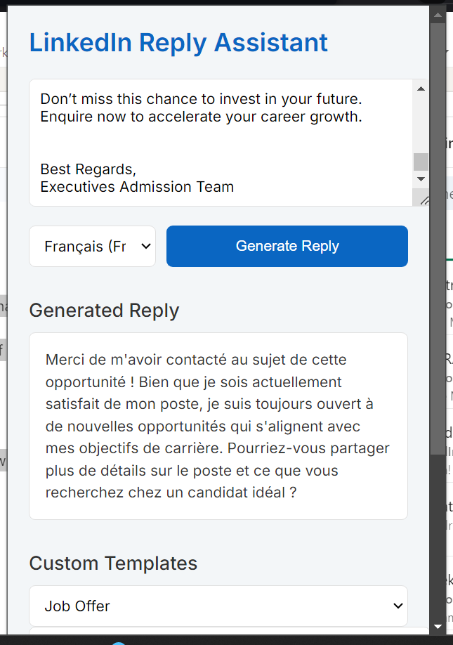

# LinkedIn Reply Assistant

LinkedIn Reply Assistant is a Chrome extension designed to help users generate contextual replies to LinkedIn messages quickly and efficiently. It analyzes incoming messages and provides appropriate response templates based on the message category and selected language.

## Features

- Analyzes incoming LinkedIn messages to determine the context (job offer, networking, inquiry, collaboration, education, or general)
- Generates appropriate reply templates in multiple languages (English, Hindi, German, Spanish, French)
- Allows users to customize and save templates for different message categories
- Works offline using local generation when not connected to LinkedIn

## Installation

To install the LinkedIn Reply Assistant Chrome extension:

1. Clone this repository or download the source code as a ZIP file and extract it.
2. Open Google Chrome and navigate to `chrome://extensions/`.
3. Enable "Developer mode" by toggling the switch in the top right corner.
4. Click "Load unpacked" and select the directory containing the extension files.
5. The LinkedIn Reply Assistant extension should now appear in your Chrome toolbar.

## Usage

1. Click on the LinkedIn Reply Assistant icon in your Chrome toolbar to open the popup.
2. Copy and paste the received LinkedIn message into the text area.
3. Select the desired language for the reply from the dropdown menu.
4. Click "Generate Reply" to create a contextual response.
5. The generated reply will appear in the "Generated Reply" section.
6. You can copy this reply and use it as a starting point for your LinkedIn message response.

## Screenshots

  
  
  
  
  
  
  

## Customizing Templates

1. Select a category from the "Custom Templates" dropdown menu.
2. Enter your custom template in the text area below.
3. Click "Save Template" to store your custom template for future use.

## Contributing

Contributions to improve LinkedIn Reply Assistant are welcome. Please follow these steps to contribute:

1. Fork the repository.
2. Create a new branch for your feature or bug fix.
3. Make your changes and commit them with descriptive commit messages.
4. Push your changes to your fork.
5. Submit a pull request to the main repository.

